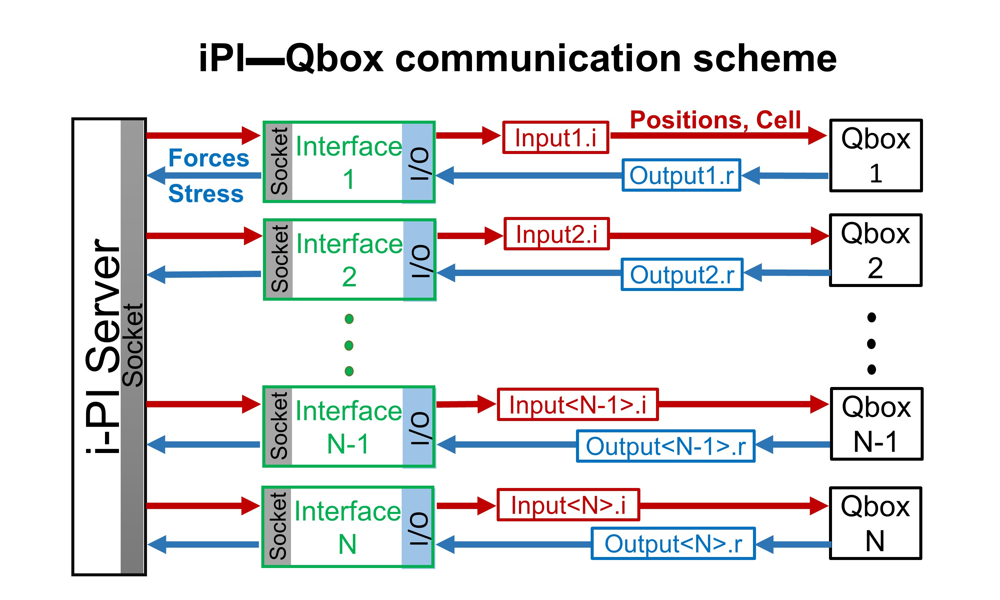

# Introduction

This interface is designed to couple [Qbox](http://qboxcode.org/) [1], a 
first principle molecular dynamics code with [i-PI](http://ipi-code.org/)[4], 
a path-integral package. 
This coupling is done using a client-server protocol. 
In an iPI---Qbox coupled simulation, 
[i-PI](http://ipi-code.org/) moves ions while 
[Qbox](http://qboxcode.org/) acts as the density-functional theory (DFT) 
engine that supplies forces and stress tensors from first-principles 
DFT calculation. 
We implemented the coupling by developing an 
external python interface client that maintains constant communication 
between an i-PI server and several Qbox servers, see the following Figure 
for the communication scheme.  

The [i-PI](http://ipi-code.org/) code is designed to keep communication 
with its clients via Unix/internet sockets. 
[Qbox](http://qboxcode.org/) has input/output (I/O) file-based 
client-server mode where an external client program can write instructions 
to an input file, which [Qbox](http://qboxcode.org/) executes. 
An output file is written and [Qbox](http://qboxcode.org/) awaits 
for further instructions from the client. 
By utilizing [Qbox](http://qboxcode.org/)'s client-server mode, 
we designed iPI---Qbox interface that acts as a client for both 
[i-PI](http://ipi-code.org/) and [Qbox](http://qboxcode.org/) servers. 

The functioning of the interface between [Qbox](http://qboxcode.org/)
 and [iPI](http://ipi-code.org/) can be understood 
with an example of a path integral molecular dynamics simulation with N 
beads where for each bead, one instance of [Qbox](http://qboxcode.org/) 
is used (though it is possible to use  a smaller number of 
[Qbox](http://qboxcode.org/) instances than beads). 
In this example, one launches an interface client for each 
[Qbox](http://qboxcode.org/) server instance. 
During an MD move, [i-PI](http://ipi-code.org/) updates the 
coordinates and cell parameters (for NPT simulations) for each bead 
and sends them through sockets to the respective interface clients. 
After receiving such information, each interface client prepares an 
input file with the necessary commands for its 
[Qbox](http://qboxcode.org/) server. 
After [Qbox](http://qboxcode.org/) receives this input, 
it executes the commands sequentially and upon completion 
it creates an output file, which contains the resulting forces and 
stress tensors. Then, the interface client reads the output file and 
collects the forces and stress tensors, and sends them to the 
[i-PI](http://ipi-code.org/) server through a socket. 
Using this information, [i-PI](http://ipi-code.org/) updates the 
ion coordinates and the cell-parameters (if required) again and sends 
the new coordinates and cell parameters to the interface clients.

# Citation

If you used i-PI simulations using Qbox as DFT engine using this interface,
please cite the following paper: 

A. Kundu, M. Govoni, H. Yang, M. Ceriotti, F. Gygi, and G. Galli.
Quantum vibronic effects on the electronic properties of 
solid and molecular carbon. 
*Phys. Rev. Materials* **2021**, 5, L070801

# References
[1] Kapil *et al*. Comput. Phys. Commun. **2019**, 236, 214.

[2] F. Gygi. IBM J. Res. Dev. **2008**, 52, 137.

# Instructions
Detailed instructions are written within the 
[interface executable file](./run_interface.py).

